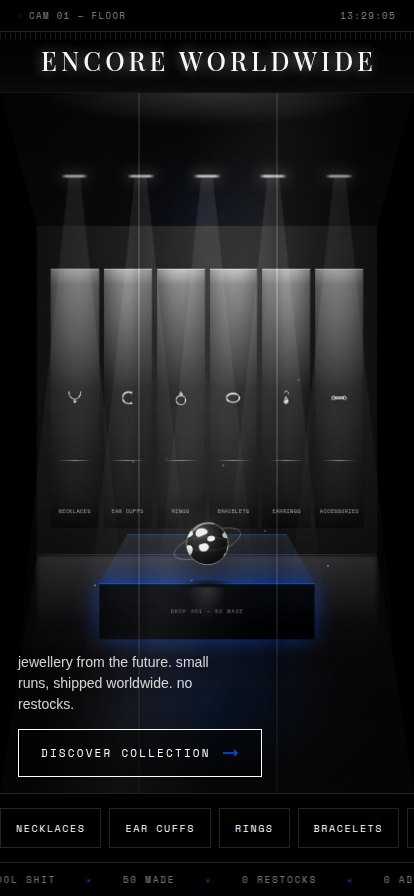
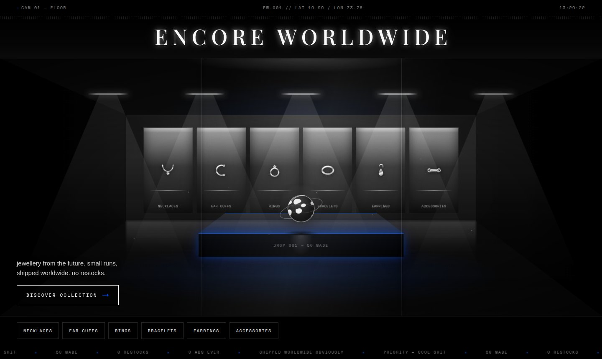

# ENCORE WORLDWIDE — storefront hero

`EW-002 // DROP 001`

A drop-in Online Store 2.0 hero. The shop — room, track lighting, display
cases, jewellery, the globe and the blue vitrine — is drawn entirely in CSS and
SVG. **No photography. No image uploads. Nothing to art-direct.**

 

## Files

| File | |
| --- | --- |
| `sections/encore-hero.liquid` | The section + theme-editor schema |
| `assets/encore-hero.css` | The whole shop |
| `assets/encore-hero.js` | Running clock + off-screen pause. Progressive enhancement only |
| `preview/index.html` | Static preview — open in a browser, no store needed |

Total weight: about 34 KB of CSS, HTML and SVG, plus two webfonts. No images,
no libraries, no build step.

## Install

1. **Online Store → Themes → ⋯ → Edit code**
2. **Assets → Add a new asset** → upload `encore-hero.css` and `encore-hero.js`
3. **Sections → Add a new section** → name it `encore-hero` → paste in `sections/encore-hero.liquid`
4. **Customize → Add section → Encore storefront hero**, drag to the top

It sits directly under your existing black nav, in the same register: black
ground, white rules, Space Mono for anything that reads as instrumentation.

## The room

Geometry is percentage-based `clip-path`, so the ceiling, side walls, back wall
and floor re-frame themselves at any aspect ratio. On a phone the camera stands
close and the room is narrow; past 750px it pulls back and widens. Two numbers
do it — `--ew-ceil` and `--ew-side`.

**Display cases** come from the section's blocks — one lit niche per category,
each with the piece drawn inside it: necklace, ear cuff, ring, bracelet,
earring, charm. The labels are the same six collections as your `ALT/
COLLECTION` grid, and the chip row below the glass is the tappable version of
the same list.

## The motion

Slow, and never all at once.

- **Lights on.** The room fades up, then the five tubes strike one after
  another — catch, drop out, catch again, hold. The sign warms up last, at 1.1s.
- **Halogen wander.** Once lit, every tube drifts between 84% and 100%, each on
  its own offset, so the room is never perfectly still.
- **One failing tube.** The fourth one stutters every six and a half seconds.
  It's the detail that makes the other four read as real.
- **Camera breath.** The whole room scales 1.000 → 1.035 over 34 seconds.
- **Glints.** A specular highlight crosses each piece of jewellery on a stagger.
- **The globe** turns on its axis, 26 seconds a lap, inside its orbit ring.
- **The vitrine** breathes its blue over 6.5 seconds, up onto the ceiling and
  down into the floor.
- **Dust** drifts up through the light beams.
- **A reflection** crosses the shop glass every 17 seconds.
- **The clock** in the camera rail runs live.

All of it is `opacity` and `transform` only — nothing touches layout, nothing
runs on the main thread. Every animation is removed under
`prefers-reduced-motion: reduce`, and the whole room pauses when it scrolls out
of view.

## Where the blue went

You asked for 5%. Almost all of it is spent on one object — the display table —
and it is edge-light rather than fill: a 1px lit rim on the glass top, a lit
seam on the front panel, a soft pool on the floor and a faint wash on the
ceiling. The only other blue in the frame is the REC dot, the button arrow and
the ✳ in the ticker. There are no colour pickers in the schema, because *no new
colors, ever* is a brand rule and belongs in code rather than in a setting.

## The sign

Set in a high-contrast serif, letter-spaced wide and lit from within — the
shopfront convention your reference uses. Playfair Display by default, with
Prata and Libre Baskerville also wired up in the picker if you want it heavier
or more transitional. If you hold a licence for the exact face, self-host it and
switch the webfont loading off.

## Mobile

- One column, 100svh with a vh fallback, nothing that needs a hover.
- 48px button, 40px chips, the chip row scrolls with snap.
- Six case labels fit without clipping down to 320px — verified, not assumed.
- No `backdrop-filter` and only two 2px blurs in the entire stylesheet, both on
  static elements. Everything animated is compositor-only.
- The dust, the glass reflection and the grain are individually switchable if
  you want to strip even more off older Androids.

## Details worth finding

- The plate etched on the vitrine reads **Drop 001 — 50 made**, and it's a
  setting.
- The globe's orbit ring is tilted to the same angle as the swoosh in your
  wordmark.
- The camera rail is a shop CCTV overlay: `CAM 01 — FLOOR`, your store's real
  coordinates, and a clock that actually ticks.
- The louvred strip above the sign is the same slatted canopy as a real
  shopfront fascia.
- The two vertical lines are the window mullions. You are standing outside,
  looking in.

## Settings worth knowing

| Setting | Notes |
| --- | --- |
| Sign / Sign typeface | The illuminated fascia |
| Line on the glass | The vinyl decal, lower left |
| Display case blocks | Label, link, and which piece sits inside |
| Etched on the vitrine | The plate on the table front |
| Globe artwork | Optional — drop in the real mark to replace the drawn one |
| One failing tube | Turn the flicker off if you want the room pristine |

## Verified

Headless Chromium at 320 / 360 / 390 / 414 / 430 / 768 / 1024 / 1440 / 1920 px:
no horizontal overflow, no clipped case labels at any width, 48px and 40px tap
targets hold, ticker flush to the hero's bottom edge, globe seated on the table
at every breakpoint, no console errors. Re-checked under
`prefers-reduced-motion: reduce`: animations gone, dust and grain removed, every
element at its final state.
