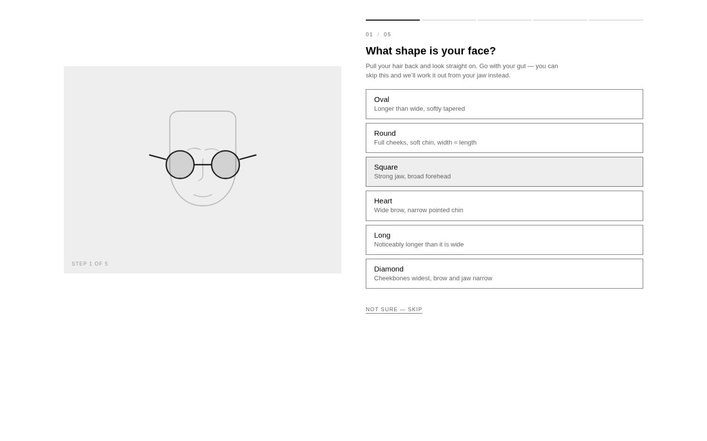
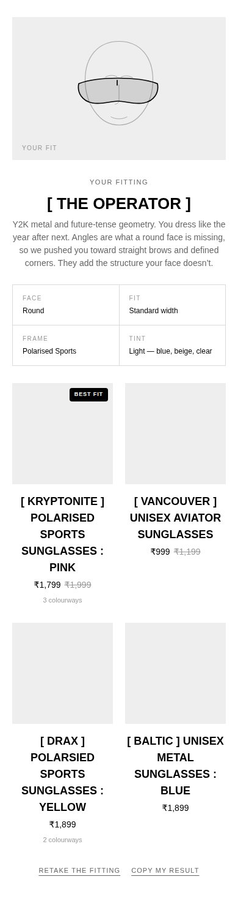

# THE FITTING ROOM — frame finder quiz

`PS-003 // PROJECT SHADES`

Six questions, about a minute, and the customer walks out with frames chosen
for their face rather than for the algorithm's convenience. A face silhouette
and a pair of lenses are drawn in SVG; both morph as they answer. The face
becomes their face shape. The lenses become the frame being recommended. At the
end the drawn pair resolves into real products from the store.

 

**No app, no subscription, no monthly fee.** One section, one stylesheet, one
script. Nothing leaves the browser.

## It looks like the rest of the store, by construction

The quiz declares almost no colours, typefaces or spacing of its own. It reads
the theme's own custom properties — `--color-background`, `--color-foreground`,
`--font-body-family`, `--font-heading-family`, `--buttons-radius`,
`--page-margin-desktop`, `--product-card-*` and the rest. Change a colour or a
font in the theme editor and the quiz moves with it. Nothing here needs
re-styling when the storefront is re-styled.

**The recommendations are the theme's own product cards.** They are not a
lookalike rebuilt in JavaScript — the section fetches `card-product` through
the Section Rendering API, so the results carry the same badges, price
formatting and sale highlighting as every collection page.

Every `var()` in the stylesheet carries a fallback matching the current theme
settings, so nothing collapses if a property is missing.

## Files

| File | |
| --- | --- |
| `sections/shades-quiz.liquid` | The section, the product index and the theme-editor schema |
| `sections/shades-quiz-card.liquid` | Renders one theme product card, fetched per result |
| `assets/shades-quiz.css` | Layout, drawn entirely from the theme's tokens |
| `assets/shades-quiz.js` | The fitting logic and the whole interface |
| `preview/quiz.html` | Static preview — open in a browser, no store needed |
| `preview/build-preview.py` | Regenerates the preview from the section, so the two cannot drift |

## Install

1. **Online Store → Themes → ⋯ → Edit code**
2. **Assets → Add a new asset** → upload `shades-quiz.css` and `shades-quiz.js`
3. **Sections → Add a new section** → name it `shades-quiz` → paste in `sections/shades-quiz.liquid`
4. **Sections → Add a new section** → name it `shades-quiz-card` → paste in `sections/shades-quiz-card.liquid`
5. **Customize → Add section → Shades fitting quiz**

Step 4 is what makes the results use your own product cards. Skip it and the
quiz still works — it falls back to a simple built-in card built from the same
theme tokens — but the cards will not carry your badges or sale styling.

It works with zero configuration otherwise. Every collection it reads is already
pre-filled with the handle this store uses.

Where to put it: its own page (`/pages/find-your-frames`) linked from the nav
is the usual answer, because it wants the whole screen. It also works dropped
on the home page under the hero.

## How it decides

**It does not read tags.** The catalogue is essentially untagged — 5 products
out of 277 carry one — so tags would have produced a quiz that recommended the
same four frames to everyone. Traits come from **collection membership**, read
through `product.collections` at render time.

That has a useful consequence: **the quiz re-merchandises itself.** Put a frame
in `techno` and it starts being offered to people who pick the techno
aesthetic. Pull it from `bestsellers` and it stops getting the popularity
nudge. No re-tagging, no re-coding, no re-deploying.

These collections are wired in already:

| Signal | Collections |
| --- | --- |
| Frame shape | Rectangular, Oval, Round, Cateye, Rimless, Wraparound, Oversized |
| Aesthetic | Vintage, Techno, Daily Luxe, Code, Ice Ice Baby |
| Use case | Polarised Sports |
| Candidate pool only | Prescription Friendly — no longer a filter, but many of the best-performing frames live there, so it still feeds the shelf |
| Confidence | Bestsellers, Staff picks, Markdowns, Buy any 3 |

Each is a setting, so if a collection is renamed or replaced, re-point it in the
theme editor rather than in code.

The product **title** is read too, for the shape words collections don't carry —
aviator, hexagon, butterfly, slim, chunky, Y2K, retro. Including `Overized`,
which is a live typo in the catalogue and is matched deliberately. A polarised
sports frame is also treated as a wraparound, because that is what the category
physically is.

### Proven performers

Two more live signals decide between frames that fit equally well. Both are read
at render time, so neither can go stale:

- **Reviews**, from the review app's metafields. Credit scales with how many
  people actually said it, saturating at 40, so one five-star review cannot
  outrank a line with eighty. Below 3.5 stars a frame is pushed down, not merely
  un-boosted.
- **Stock depth**, on a log curve — the step from 10 units to 100 matters far
  more than 800 to 900. Deep stock is the signal to push: the line was bought
  into, it won't sell out under the customer mid-fitting, and it's the range the
  shop stands behind.

Membership of **Bestsellers** and **Staff picks** adds a little on top.

Together these are bounded so they rank well-fitting frames against each other
rather than overruling the fit — a bestseller in the wrong shape still loses to
the right shape.

### Tint

Tint has to distinguish *"this frame is dark"* from *"this frame comes in six
colours, one of which is dark"* — otherwise every deep line matches both
preferences and the question does nothing. A frame split one product per
colourway states its tint exactly in its `: Colour` suffix and scores full
credit; a frame that keeps its colours as variants scores partial credit, so it
sits below an exact match without being excluded.

### The fitting table

The rule is contrast, not echo: you give a face the geometry it hasn't got.

The six questions are: face shape, how frames currently sit, aesthetic, where
they'll be worn, and lens tint — plus a jawline question that only appears if
the face-shape question is skipped.

| Face | Pushed toward | Pushed away from |
| --- | --- | --- |
| Round | Rectangular, cat-eye, wraparound, hexagon | Round, oval |
| Square | Round, oval, rimless, aviator | Rectangular, wraparound |
| Oval | Everything — scored on aesthetic instead | — |
| Heart | Rimless, round, oval, aviator | Oversized |
| Long | Oversized, wraparound, round | Slim, rimless |
| Diamond | Cat-eye, oval, rimless, round | Rectangular |

Fit is weighted **3×** above aesthetic and popularity. That matters: without it
a bestseller in the wrong shape outranks the right shape, which is the one
failure a fitting quiz cannot afford. Bestsellers now only break near-ties.

### Sport is a constraint, not a taste

Answering *"running, riding, gym"* narrows to the polarised sports range
outright. A frame that isn't built for sport is the wrong answer however well it
suits the face, so this is the one hard filter in the quiz.

### The width question

Nobody owns a pupillometer, so the quiz never asks for a measurement. It asks
how sunglasses *currently sit*:

- *They slide down my nose* → the frame is too wide → slim frames, oversized penalised
- *They press on my temples* → too narrow → oversized and wraparound promoted
- *They look small on me* → statement widths

### Colourways

`[ Apollo ] Rectangular Unisex Sunglasses : Black` — the house naming
convention is load-bearing. The alias in brackets is what stops four colourways
of one frame from filling the entire result. Results show one row per alias with
a *"5 colourways"* note, so the customer still learns the other colours exist.

## What the customer gets

An alias in the house style — `[ THE ARCHIVIST ]`, `[ THE OPERATOR ]`,
`[ THE ICON ]`, `[ THE GLACIER ]`, `[ THE SPRINTER ]`, `[ THE REGULAR ]`,
`[ THE PURIST ]` — then a plain-English verdict explaining *why* that shape
suits that face, a spec read-out of the four inputs used, and the frames
themselves with the best fit flagged.

The explanation is the point. A quiz that just spits out products reads as a
sales funnel; one that tells you a strong jaw is already doing the geometry
reads as a fitting.

## Details worth knowing

- **Skipping is handled.** "Not sure" on the face question asks about the
  jawline instead, which most people can answer, and infers the shape from it.
- **The stage answers before you click.** Hovering or focusing an option
  previews the consequence — the face morphs, the frame changes.
- **Out of stock** frames are hidden by default and can be shown instead.
  Availability is scored, not assumed; plenty of active products sit at zero.
- **The result is remembered** in `localStorage` — returning visitors are
  offered it back. Nothing is transmitted anywhere.
- **Quick-add is off** on the result cards. These frames come in colourways, so
  the customer should land on the product page and choose one.
- **Analytics.** `psq:start`, `psq:answer` and `psq:complete` fire as DOM events
  on the section and are pushed to `window.dataLayer` when GTM is present. The
  complete event carries the face shape, archetype and product handles.

## Settings worth knowing

| Setting | Notes |
| --- | --- |
| Use the theme's own product cards | On by default. Falls back to a built-in card if the companion section is missing |
| Frames to recommend | 2–8, default 4 |
| Hide sold-out frames | On by default |
| Frames read per collection | 40 covers this catalogue; raise for better matches, lower for a lighter page |
| Fallback collection | Linked when a fitting is too narrow, and from the no-JavaScript message |
| Lens tint | The one colour on the stage |
| Collection pickers | Re-point any signal without touching code |

The questions and the scoring live in `assets/shades-quiz.js`, in two clearly
marked blocks at the top of the file — `FIT` and `QUESTIONS`. Both are plain
data. Change the numbers to change the recommendations.

## Verified

Headless Chromium, `preview/quiz.html` against a live 178-frame snapshot of the
catalogue:

- **All 2,160 answer combinations** (6 faces × 4 fits × 6 aesthetics × 5
  use-cases × 3 tints) return results. The thinnest returns 8 frames — the
  sports-narrowed path — and no combination dead-ends.
- **Every face shape returns only on-doctrine frames** in its top four.
- **36 different frames** take the top slot across those runs, the most frequent
  at 13.8% — proven lines lead without one product owning the quiz.
- Each of the three tint answers returns a visibly different shelf.
- Sports filter: 100% of results are sports frames. Sold-out filter: no leaks.
  Colourway dedupe: no repeated alias in any result.
- No horizontal overflow at 320 / 360 / 390 / 414 / 430 / 768 / 1024 / 1440 /
  1920 px. No tap target under 44px. No console errors.
- Keyboard: arrow keys walk the options, Enter selects, the question takes focus
  on each step.
- Under `prefers-reduced-motion: reduce`: zero animating elements, grain removed.
- Back button re-plans correctly, including backing out of a skipped question.

Re-verified after the section was rebuilt to inherit the theme: the quiz reads
`#ffffff` background, `#000000` text, Work Sans at 15px, black square uppercase
buttons and a 40px page margin straight from the theme's tokens — none of it
hardcoded.

Two things the preview cannot reproduce, both noted in the file itself:

- Headings fall back to Archivo. The live theme uses Basic Commercial, which is
  Shopify-hosted and cannot load in a static file. Both are grotesques of the
  same weight, so the layout reads the same.
- Results use the built-in fallback card, because a `file://` page has no
  storefront to fetch from. On the store the theme's own cards are used.

The preview's product images load from the Shopify CDN, so they appear when you
open it on a normal connection.
